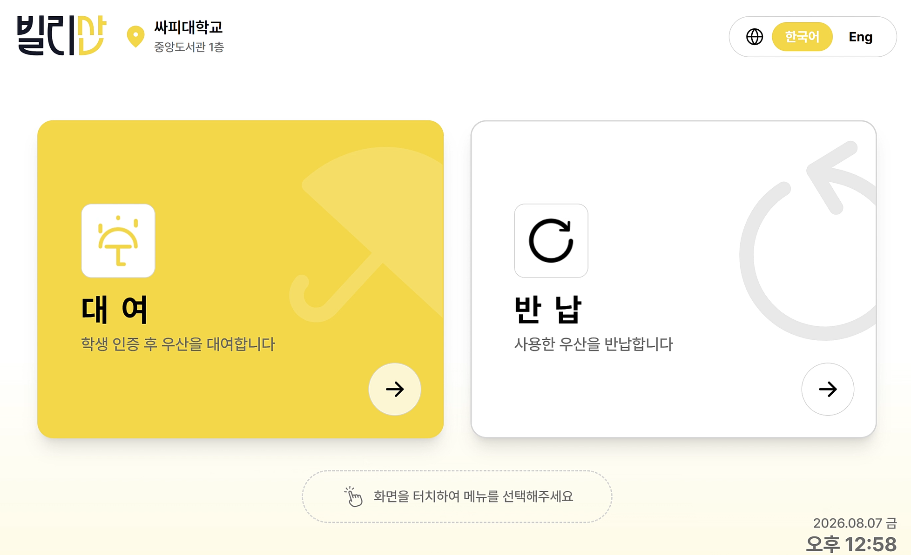

# Billisan · 빌리산

**얼굴 인증과 AI 파손 검수를 활용한 우산 대여·반납 서비스**

빌리산은 갑작스러운 비에도 가까운 대여소에서 우산을 빌리고 반납할 수 있도록 돕는 서비스입니다.
키오스크의 이용 흐름과 관리자 웹의 재고·검수 기능을 연결하고, AI로 반납한 우산의 상태를 확인합니다.



## 핵심 기능

### 우산 대여·반납

- 얼굴 인증 안내와 인증 결과 확인을 거쳐 대여·반납을 진행하는 키오스크 UI
- 대여 가능 재고와 반납 가능 슬롯 안내, 처리 단계별 진행 상태 표시
- 요청 멱등성, 슬롯 동시성 제어와 데이터베이스 제약을 통한 대여 상태 관리

### AI 우산 파손 검수

- YOLO 기반 우산 검출과 관심 영역 크롭
- DINOv2 특징과 PatchCore를 활용한 이상 탐지
- 정상·파손·판단 보류 결과를 구분하고 관리자 검수 흐름과 연결

### 관리자 웹

- 대시보드와 대여소별 우산 재고·슬롯 상태 조회
- 대여·반납 이력 및 파손 검수 결과 확인
- 우산 상태 변경과 관리자 최종 판정
- JWT 기반 관리자 인증과 역할별 API 접근 제어

### 서비스 안내 챗봇

- 서비스 이용 방법, 대여 정책과 과금 기준 안내
- FAQ 문서와 OpenAI 호환 API를 활용한 답변 생성

## 서비스 흐름

```text
대여  이용 선택 → 얼굴 인증 → 이용 자격 확인 → 슬롯 안내 → 우산 인출
반납  이용 선택 → 얼굴 인증 → 우산 촬영·AI 검수 → 슬롯 안내 → 반납 결과 확인
관리  재고·슬롯 조회 → 검수 결과 확인 → 관리자 판정·상태 관리
```

키오스크와 Pi는 WebSocket으로, 백엔드와 Pi는 MQTT로 메시지를 주고받습니다.
MySQL에서 대여·슬롯·검수 상태를 관리하며, 관리자 웹은 REST API로 업무 데이터를 조회하고 변경합니다.

## 기술 스택

| 영역 | 기술 |
| --- | --- |
| Backend | Java 21, Spring Boot, Spring Security, JPA, Flyway, JWT |
| Admin Web | React, TypeScript, Vite, TanStack Query, Zustand, Tailwind CSS |
| Kiosk | React, TypeScript, Vite, Zustand, Tailwind CSS, PWA |
| AI | Python, Ultralytics YOLO, DINOv2, Anomalib PatchCore, ONNX |
| Data & Messaging | MySQL, Mosquitto MQTT, WebSocket |
| Build & Test | Docker Compose, GitHub Actions, JUnit, Vitest |

## 프로젝트 구조

```text
Billisan/
├── backend/                  # 인증, 대여 상태, 재고·검수 API, MQTT, 챗봇
├── frontend/
│   ├── web/                  # 관리자 웹
│   └── kiosk/                # 대여·반납 키오스크
└── ai/
    └── anomaly_detection/    # 우산 검출, 데이터 전처리, 학습·추론
```

## 시작하기

Node.js 22.12 이상을 사용하며, 백엔드 실행에는 Java 21 또는 Docker Compose가 필요합니다.
각 구성요소의 `.env.example`을 복사한 뒤 실행 환경에 맞게 값을 설정합니다.

| 구성요소 | 작업 경로 | 실행 |
| --- | --- | --- |
| 관리자 웹 | `frontend/web` | `pnpm install --frozen-lockfile` → `pnpm dev` |
| 키오스크 | `frontend/kiosk` | `npm ci` → `npm run dev` |
| 백엔드 | `backend` | `docker compose --env-file .env up --build` |

관리자 웹은 pnpm 9.15.9를 사용합니다. 상세 설정은 [관리자 웹](frontend/web/README.md),
[키오스크](frontend/kiosk/README.md), [AI 파이프라인](ai/anomaly_detection/README.md) 문서를 참고하세요.
